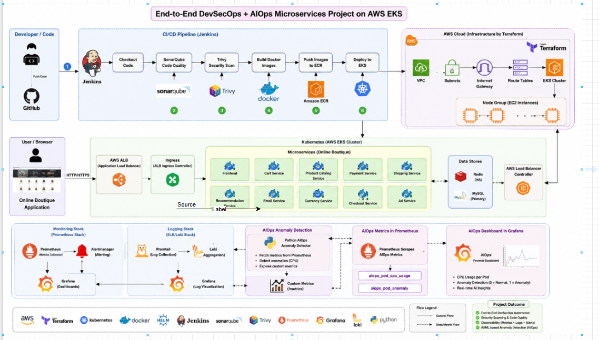

# 🚀 End-to-End DevSecOps + AIOps Microservices Project on AWS EKS

## 📌 Project Overview

This project demonstrates a complete production-style DevSecOps + AIOps platform built on AWS using Kubernetes and modern cloud-native DevOps tools.

The application used in this project is the Google Online Boutique Microservices Application deployed on AWS EKS.

The project covers:

* Infrastructure provisioning using Terraform
* Kubernetes orchestration using Amazon EKS
* CI/CD automation using Jenkins
* Code quality analysis using SonarQube
* Security scanning using Trivy
* Containerization using Docker
* Image storage using Amazon ECR
* Monitoring using Prometheus and Grafana
* Centralized logging using Loki and Promtail
* AI-powered anomaly detection using Python-based AIOps service

---

# 🏗️ Architecture Flow

```text
Developer → GitHub → Jenkins CI/CD → SonarQube → Trivy → Docker Build → Amazon ECR → AWS EKS → Kubernetes Microservices → Prometheus/Grafana → Loki Logging → Python AIOps Engine → Grafana AI Dashboard
```

---

# 🛠️ Tools & Technologies Used

| Category               | Tools                          |
| ---------------------- | ------------------------------ |
| Cloud                  | AWS                            |
| Infrastructure as Code | Terraform                      |
| Containerization       | Docker                         |
| Orchestration          | Kubernetes, Amazon EKS         |
| CI/CD                  | Jenkins                        |
| Security               | Trivy                          |
| Code Quality           | SonarQube                      |
| Monitoring             | Prometheus, Grafana            |
| Logging                | Loki, Promtail                 |
| Container Registry     | Amazon ECR                     |
| AI/ML                  | Python AIOps Anomaly Detection |
| Version Control        | GitHub                         |
| Package Management     | Helm                           |

---

# 📂 Project Structure

```text
ai-ml-aiops-microservices-devops-project/
│
├── app/
├── terraform/
├── kubernetes/
├── monitoring/
├── security/
├── jenkins/
├── aiops/
├── docs/
└── README.md
```

---

# ☁️ Infrastructure Provisioning Using Terraform

Terraform was used to provision the AWS infrastructure.

## Resources Created

* VPC
* Public & Private Subnets
* Internet Gateway
* Route Tables
* EKS Cluster
* Node Groups
* IAM Roles
* Security Groups

## Terraform Commands

### Initialize Terraform

```bash
terraform init
```

### Validate Terraform Files

```bash
terraform validate
```

### Preview Infrastructure

```bash
terraform plan
```

### Create Infrastructure

```bash
terraform apply
```

---

# ☸️ Kubernetes Cluster Setup

After provisioning the infrastructure, kubeconfig was updated.

```bash
aws eks update-kubeconfig --region us-east-1 --name ai-ml-aiops-eks
```

Verify nodes:

```bash
kubectl get nodes
```

---

# 🚦 AWS Load Balancer Controller

Configured AWS Load Balancer Controller to create Application Load Balancer using Kubernetes Ingress.

### Associate OIDC Provider

```bash
eksctl utils associate-iam-oidc-provider --region us-east-1 --cluster ai-ml-aiops-eks --approve
```

### Install AWS Load Balancer Controller

```bash
helm install aws-load-balancer-controller eks/aws-load-balancer-controller \
-n kube-system \
--set clusterName=ai-ml-aiops-eks
```

---

# 🐳 Docker & Amazon ECR

Docker was used to build images and push them to Amazon ECR.

### Build Docker Image

```bash
docker build -t frontend:v1 .
```

### Tag Docker Image

```bash
docker tag frontend:v1 <ECR-URL>/frontend:v1
```

### Push Docker Image

```bash
docker push <ECR-URL>/frontend:v1
```

---

# ☸️ Kubernetes Deployment

Microservices were deployed to Amazon EKS using Kubernetes manifests.

### Deploy Application

```bash
kubectl apply -f kubernetes/
```

### Verify Pods

```bash
kubectl get pods
```

### Verify Services

```bash
kubectl get svc
```

### Verify Ingress

```bash
kubectl get ingress
```

---

# 🔄 Jenkins CI/CD Pipeline

A complete Jenkins CI/CD pipeline was implemented.

## Pipeline Stages

* GitHub Checkout
* SonarQube Scan
* Trivy Security Scan
* Docker Build
* Push to Amazon ECR
* Deploy to Kubernetes
* Monitoring Validation

---

# 🔍 SonarQube Integration

SonarQube was integrated for:

* Code quality analysis
* Security hotspot detection
* Code smell detection
* Quality gates

### Access SonarQube

```bash
kubectl port-forward -n sonarqube svc/sonarqube-sonarqube 9000:9000
```

Open:

```text
http://localhost:9000
```

---

# 🛡️ Trivy Security Scanning

Trivy was integrated into the CI/CD pipeline to scan Docker images for vulnerabilities.

### Scan Docker Image

```bash
trivy image <IMAGE-NAME>
```

Trivy scans for:

* CRITICAL vulnerabilities
* HIGH vulnerabilities
* Misconfigurations
* Security risks

---

# 📊 Monitoring Using Prometheus & Grafana

Prometheus and Grafana were installed using Helm.

## Monitoring Features

* Kubernetes metrics
* Pod CPU usage
* Memory usage
* Cluster monitoring
* Real-time dashboards

### Access Grafana

```bash
kubectl port-forward -n monitoring svc/monitoring-grafana 3000:80
```

Open:

```text
http://localhost:3000
```

---

# 📝 Logging Using Loki & Promtail

Loki and Promtail were configured for centralized log aggregation.

## Features

* Pod log collection
* Centralized logging
* Grafana log visualization
* Kubernetes log monitoring

---

# 🤖 AIOps Anomaly Detection

A custom Python-based AIOps service was developed to detect anomalies from Prometheus metrics.

## AIOps Workflow

```text
Prometheus Metrics → Python AIOps Engine → Custom Metrics → Grafana Dashboard
```

## Features

* Fetch metrics from Prometheus
* Analyze pod CPU usage
* Detect abnormal pod behavior
* Export custom metrics
* Visualize anomalies in Grafana

## Custom Metrics

```text
aiops_pod_cpu_usage
aiops_pod_anomaly
```

## Meaning

```text
0 = Normal
1 = Anomaly Detected
```

---

# 📈 Grafana AIOps Dashboard

Created a custom Grafana dashboard to visualize:

* Pod CPU Usage
* AI-based anomaly detection
* Real-time monitoring insights

## Prometheus Queries

### Anomaly Detection

```promql
aiops_pod_anomaly
```

### Pod CPU Usage

```promql
aiops_pod_cpu_usage
```

---

# ⚠️ Challenges Faced & Solutions

| Challenge                         | Solution                            |
| --------------------------------- | ----------------------------------- |
| OIDC provider missing             | Associated IAM OIDC provider        |
| ImagePullBackOff                  | Corrected container images          |
| ALB creation failure              | Fixed subnet tagging                |
| Jenkins Pending                   | Disabled persistent storage         |
| GitHub push failure               | Added Terraform files to .gitignore |
| Prometheus target discovery issue | Fixed ServiceMonitor configuration  |

---

# ✅ Final Outcome

Successfully built a production-style DevSecOps + AIOps platform integrating:

* CI/CD
* Security
* Kubernetes
* Monitoring
* Logging
* Observability
* AI-powered anomaly detection

---

# 📸 Screenshots




#DevOps #AIOps #DevSecOps #Kubernetes #AWS #Terraform #Docker #Jenkins #Prometheus #Grafana #Python #CloudComputing #EKS #Microservices #OpenToWork
